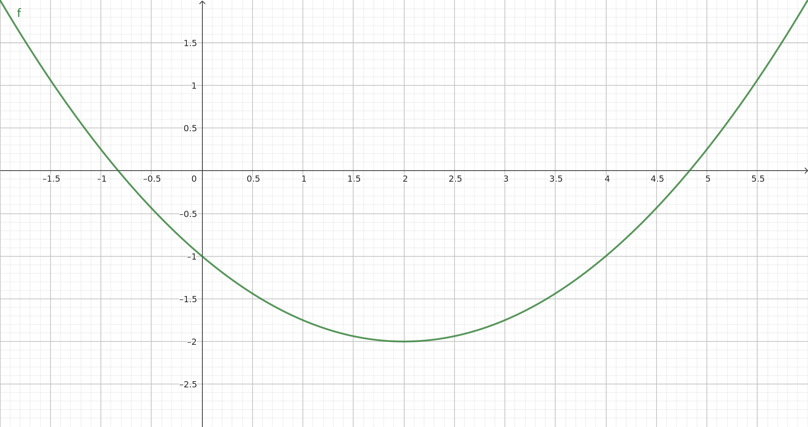

# Part 2: Programming exercise

## Objective
Develop root-finding algorithms in C++ that exploit polymorphism and/or templates, provide Python bindings using pybind11, and run some test cases. The exercise involves creating classes for defining the root-finding problems and implementing algorithms such as the bisection method and Newton-Raphson method.

---

## Mathematical background

### Root-finding: general overview
Root-finding algorithms are used to find the roots (or zeroes) of a function $f(x)$, i.e., the values of $x$ for which $f(x) = 0$. These methods are fundamental in numerical analysis and are widely used in various scientific and engineering applications.

### Bisection method
The bisection method is a simple and robust root-finding algorithm that repeatedly divides an interval in half and selects the subinterval in which the root must lie.

Given a continuous function $f$ and an interval $[a, b]$:

1. **Initialization**: Start with an initial interval $[a, b]$ such that $f(a)$ and $f(b)$ have opposite signs.
2. **Midpoint calculation**: Compute the midpoint $c = \frac{a + b}{2}$.
3. **Subinterval selection**: Determine the subinterval $[a, c]$ or $[c, b]$ where the sign of $f$ changes.
4. **Iteration**: Repeat steps 2 and 3 until the interval $[a, b]$ is sufficiently small or $|f(c)|$ is sufficiently small.
5. **Output**: The midpoint of the final interval is the root.

### Newton-Raphson method
The Newton-Raphson method is an iterative root-finding algorithm that uses the function value and its derivative to approximate the root.

Given a differentiable function $f$ and its derivative $f'$:

1. **Initialization**: Start with an initial guess $x_0$.
2. **Iteration**: Update the guess using the formula $x_{n+1} = x_n - \frac{f(x_n)}{f'(x_n)}$.
3. **Convergence check**: Repeat step 2 until $|x_{n+1} - x_n|$ is below a certain threshold or $|f(x_{n+1})|$ is sufficiently small.
4. **Output**: The final value $x_n$ is the root.

---

## Tasks
The goal is to implement root-finding algorithms for the following problems:

### Task 1: Design the base class for root-finding problems in C++ (3 points)
- **Create an abstract base class `RootFindingMethod`**:
  - Include virtual methods to initialize the algorithm, a `find_root` virtual method for solving the problem, and methods to return the number of iterations and the solution.

### Task 2: Implement specific root-finding algorithm classes (5 points)
1. **Define two classes that inherit from `RootFindingMethod`**:
   - **`BisectionMethod`**: Implements the bisection method.
   - **`NewtonRaphsonMethod`**: Implements the Newton-Raphson method.
2. The user will select the algorithm at runtime, exploiting polymorphism.

### Task 3: Implement a specific root-finding problem (2 points)
- **Implement a class that describes the following root-finding problem**: $f(x) = 0.25 x^2 - x - 1 = 0$. For reference, the exact solutions are $x_1 \simeq -0.8284271247462$ and $x_2 \simeq 4.8284271247462$.

The function $f(x)$ is shown below.

### Task 4: Configuration and compilation (1 point)
- **Develop a CMake script for easy compilation of the C++ library**.
  - Provide clear instructions on compiling the library.

### Task 5: Python bindings using pybind11 (2.5 points)
- **Bind the C++ classes and methods to Python**:
  - Ensure the Python interface is user-friendly and adheres to Python conventions.
  - Create Python scripts to test the functionality of the root-finding algorithms through the bindings.

### Task 6: Testing and validation (1.5 point)
- **Write test cases**:
  - Validate the algorithms running both algorithms twice for the approximation of $x_1$ and $x_2$, solution to the problem specified in Task 3.
  - Compare results with existing Python libraries (e.g., SciPy).

### Task 7 (Bonus - 3 points)
1. Let the root-finding classes be templated over the number of equations to be solved, to allow the solution of both scalar and vector equations.
2. Compare performance metrics between the C++ and Python implementations.
3. Use `setuptools` to set up the build process for the Python bindings.
4. Write automatic tests for both the C++ and the Python implementation.
