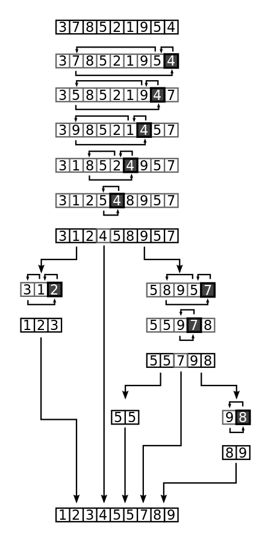
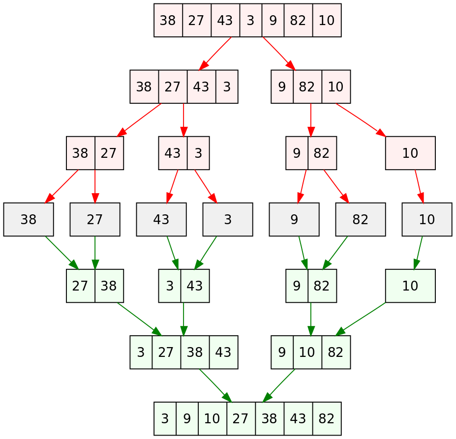

# Part 2: Programming exercise

## Objective
Develop sorting algorithms in C++ that exploit polymorphism and/or templates, provide Python bindings using pybind11, and run some test cases. The exercise involves creating classes for defining the sorting problems and implementing algorithms such as the quicksort and mergesort.

---

## Algorithmic background

### Sorting: general overview
Sorting algorithms are used to rearrange elements in a list or array in a certain order, typically in ascending or descending order. These methods are fundamental in computer science and are widely used in various applications such as searching and data analysis.

### Quicksort
Quicksort is a divide-and-conquer algorithm that works by selecting a *pivot* element and partitioning the array into two sub-arrays, which are then sorted recursively.

Given an array $A$ of $n$ elements:

1. **Initialization**: If the array has fewer than two elements, return immediately as there is nothing to do. Otherwise, select random a *pivot* element from the array.
2. **Partitioning**: Reorder the array elements, while determining a point of division, so that all elements with values less than the pivot come before the division, while all elements with values greater than the pivot come after it; elements that are equal to the pivot can go either way.
3. **Recursion**: Recursively apply the quicksort to the sub-range up to the point of division and to the sub-range after it, possibly excluding from both ranges the element equal to the pivot at the point of division.
4. **Output**: The entire array is sorted.

### Mergesort
Mergesort is a divide-and-conquer algorithm that works by dividing the array into two halves, sorting each half, and then merging the two sorted halves.

Given an array $A$ of $n$ elements:

1. **Initialization**: Divide the array into two halves.
2. **Recursion**: Recursively sort each half until the subarray size is equal to 1.
3. **Merging**: Sort each half and merge the two sorted halves to produce the sorted array.
4. **Output**: The entire array is sorted.

---

## Tasks
The goal is to implement sorting algorithms for the following problems:

### Task 1: Design the base class for sorting problems in C++ (3 points)
- **Create an abstract base class `SortingMethod`**:
  - Include virtual methods to initialize the algorithm, a `sort` virtual method for solving the problem, and methods to return the number of comparisons and the sorted array.

### Task 2: Implement specific sorting algorithm classes (5 points)
1. **Define two classes that inherit from `SortingMethod`**:
   - **`QuicksortMethod`**: Implements the quicksort algorithm.
   - **`MergesortMethod`**: Implements the mergesort algorithm.
2. The user will select the algorithm at runtime, exploiting polymorphism.

### Task 3: Implement a specific sorting problem (2 points)
- **Implement a class that describes the following sorting problem**: Sort an array of integers $A = [3, 6, 1, 5, 9, 8]$. The expected output is the sorted array $[1, 3, 5, 6, 8, 9]$.

### Task 4: Configuration and compilation (1 point)
- **Develop a CMake script for easy compilation of the C++ library**.
  - Provide clear instructions on compiling the library.

### Task 5: Python bindings using pybind11 (2.5 points)
- **Bind the C++ classes and methods to Python**:
  - Ensure the Python interface is user-friendly and adheres to Python conventions.
  - Create Python scripts to test the functionality of the sorting algorithms through the bindings.

### Task 6: Testing and validation (1.5 point)
- **Write test cases**:
  - Validate the algorithms by sorting different arrays and comparing results with existing Python libraries (e.g., NumPy).

### Task 7 (Bonus - 3 points)
1. Let the sorting classes be templated over the data type to allow sorting of arrays of different types (e.g., integers, floating-point numbers).
2. Compare performance metrics between the C++ and Python implementations.
3. Use `setuptools` to set up the build process for the Python bindings.
4. Write automatic tests for both the C++ and the Python implementation.
